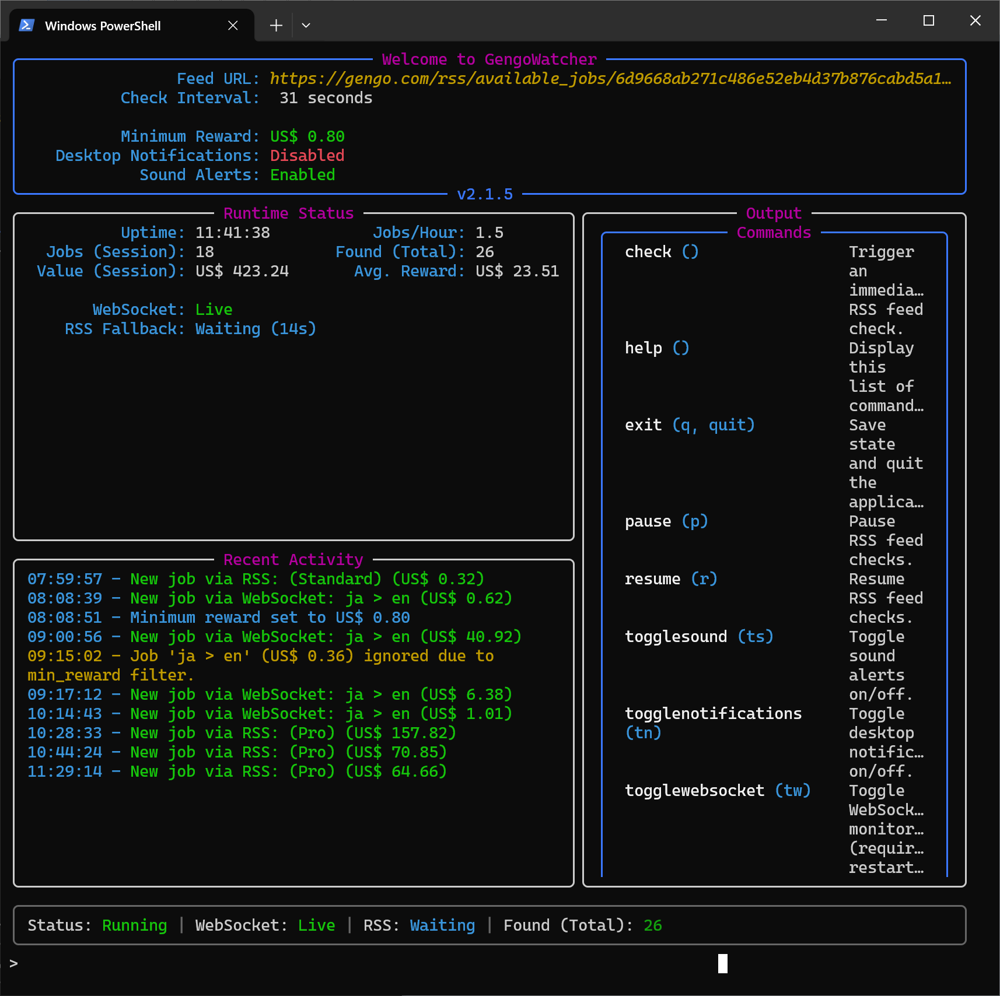

# GengoWatcher v2.1.5

GengoWatcher is a terminal application designed to find and alert you to new freelance jobs the instant they become available. It monitors both your personal Gengo RSS feed and a real-time WebSocket connection, ensuring maximum notification speed.

It features an interactive text-based user interface (TUI) that runs directly in your terminal, providing real-time status updates, activity logs, and command controls.

---

## ✨ Key Features

- **Dual-Source Monitoring**: Fetches jobs from both a personal RSS feed (as a fallback) and a real-time WebSocket connection.
- **Highly Efficient**: Near-zero CPU usage when idle, ensuring it runs quietly in the background without impacting system performance.
- **Responsive Interactive TUI**: A clean, modern interface that provides at-a-glance status, feels responsive to user input, and includes command controls.
- **Interactive Diagnostics**: A `wstest` command allows you to test WebSocket connectivity and the full notification pipeline on demand.
- **Customizable Alerts**:
    - Filter jobs by a minimum reward value.
    - Toggle desktop and sound alerts on/off.
- **Interactive Controls**: Pause, resume, restart, and trigger manual checks on the fly.
- **Robust & Resilient**: Handles connection errors with an exponential backoff strategy and runs correctly even in non-interactive terminals.
- **Persistent State**: Remembers the last job seen, so you only get notified about truly new entries.
- **CSV Logging**: Optionally logs every job entry to a CSV file for historical data analysis.

---



---


## ⚙️ Usage

**1. Launch the Application**

From your terminal, run:

```bash
python -m gengowatcher.main
```

**2. First-Time Setup**

The first time you run GengoWatcher, it will detect that it's a new installation and guide you through an interactive setup. It will ask for essential details needed for WebSocket and RSS monitoring.

> **How to find your Gengo `user_id` and `user_session`:**
>
> 1.  Log in to your Gengo dashboard in your web browser.
> 2.  Open your browser's Developer Tools (usually by pressing `F12` or `Ctrl+Shift+I`).
> 3.  Go to the **Network** tab.
> 4.  In the filter box, type `ws` or `websocket` to find the WebSocket connection. You should see an entry for `live-dashboard.gengo.com`.
> 5.  Click on this entry, and then look at the **Messages** or **Payload** tab.
> 6.  The very first message sent from your browser to the server will contain your `user_id` and `user_session` token. Copy these values into the terminal prompts.

**3. Start Monitoring**

After you complete the prompts, the application will automatically save your details to `config.ini` and begin monitoring for jobs. You can edit this file later to fine-tune your settings.

## ⌨️ Commands

Type commands directly into the TUI and press `Enter` to execute them.

| Command               | Aliases      | Description                                                 |
| --------------------- | ------------ | ----------------------------------------------------------- |
| `check`               |              | Trigger an immediate RSS feed check.                        |
| `clear`               |              | Clear the command output panel.                             |
| `exit`                | `q`, `quit`  | Save the current state and exit the application.            |
| `help`                |              | Display the list of available commands.                     |
| `notifytest`          | `nt`         | Send a test notification to check sound and alerts.         |
| `pause`               | `p`          | Pause feed checks. A `gengowatcher.pause` file is created.  |
| `reloadconfig`        | `rl`         | Reload all settings from `config.ini`.                      |
| `restart`             |              | Restart the entire script.                                  |
| `resume`              | `r`          | Resume feed checks by deleting the pause file.              |
| `setminreward <amt>`  | `smr <amt>`  | Set a minimum reward value (e.g., `smr 5.50`).              |
| `togglenotifications` | `tn`         | Toggle desktop notifications on or off.                     |
| `togglesound`         | `ts`         | Toggle sound alerts on or off.                              |
| `togglewebsocket`     | `tw`         | Toggle WebSocket monitoring (requires restart).             |
| `wstest [mode]`       | `wt`         | Test the watcher. `wt` checks the WebSocket connection. `wt notify` sends a test job. |

---

## 🐛 Troubleshooting

#### Terminal Flickering or Rendering Issues

This application uses a Text-Based User Interface (TUI) which draws and redraws itself rapidly. Older terminals (like the default `cmd.exe` or `powershell.exe` on Windows) may struggle to keep up, causing flickering or graphical glitches.

**Solution**: Use a modern, hardware-accelerated terminal for the best experience.
-   **Windows**: [**Windows Terminal**](https://aka.ms/terminal) (recommended, available on the Microsoft Store)
-   **macOS**: [**iTerm2**](https://iterm2.com/)
-   **Linux/Cross-Platform**: [**Alacritty**](https://alacritty.org/), [**Kitty**](https://sw.kovidgoyal.net/kitty/)
